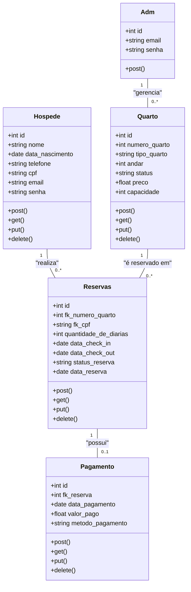
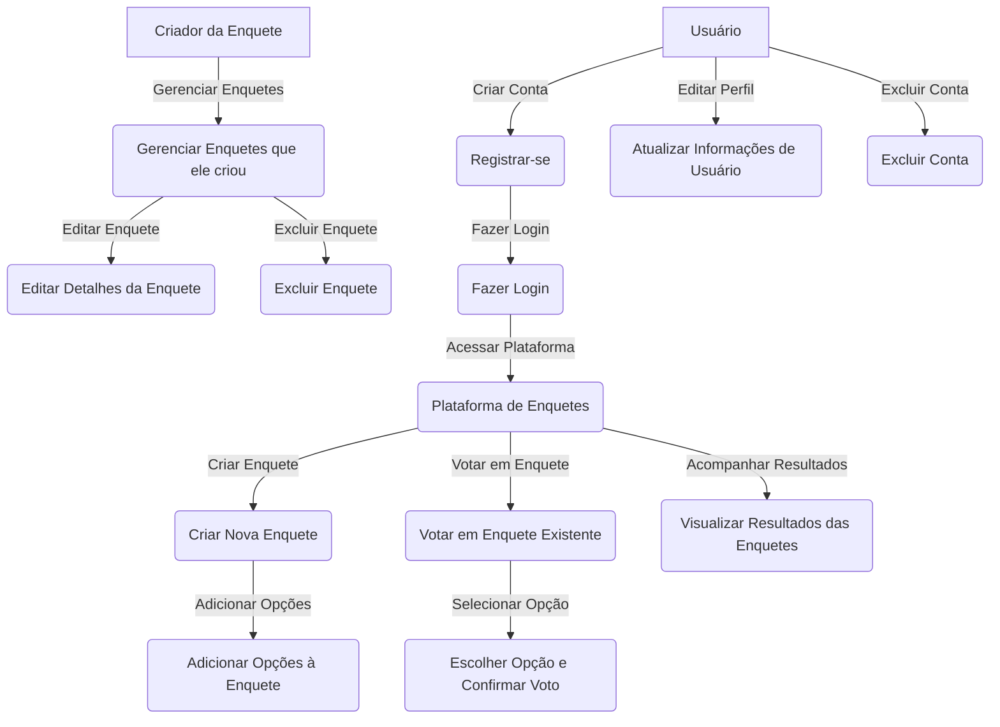
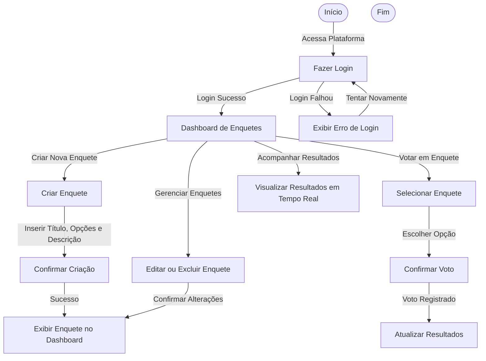

</a>
### Contexto Inicial
**Gerenciamento de Reservas de Hotel:**
O sistema será um gerenciamento de reservas de hotel, no qual o funcionário poderá cadastrar quartos, gerenciar reservas e ter acesso aos extratos de emissão fiscal, enquanto que o hóspede poderá solicitar a sua reserva em quartos disponíveis caso preenche os requisitos necessários.

 
 
 

   

   
  
  
  

 
   

</a>

## Apresentação do Projeto: Desenvolvimento de Aplicação sobre Gerenciamento de Reservas

### Visão Geral do Projeto
**Objetivo:**
Desenvolver um sistema para gerenciamento de reservas de hotel, onde os funcionários poderão cadastrar quartos, gerenciar reservas e acessar extratos de emissão fiscal. Hóspedes poderão solicitar reservas em quartos disponíveis, atendendo aos requisitos necessários. A aplicação utilizará tecnologias modernas e práticas de mercado, garantindo segurança, escalabilidade e uma experiência de usuário fluida por meio de Java para a interface e Node.js para a API, com MongoDB como banco de dados.

**Por Que Este Projeto?**
A nossa empresa chamada Hostly, dedicada a inovar no campo da gestão de serviços, está em processo de criação de um sistema de gerenciamento de reservas de hotel. Este projeto visa proporcionar uma experiência eficiente tanto para os funcionários quanto para os hóspedes, facilitando o processo de reserva e gerenciamento dos quartos. Com o objetivo de transformar a forma como os hotéis gerenciam suas reservas e atendem aos hóspedes, estamos desenvolvendo uma solução tecnológica avançada que ofereça uma interface amigável e funcionalidades robustas.
     
</a>

O sistema de gerenciamento de reservas será desenvolvido utilizando Node.js para a API e Java para a interface, com MongoDB como banco de dados. A solução visa proporcionar uma experiência de usuário intuitiva, com recursos para cadastro e gerenciamento de quartos, reservas, emissão de contratos e relatórios financeiros.
     

</a>

**Equipe:**
- 1 Gerente de Projetos
- 3 Desenvolvedores Full-Stack (Node.js e Java)
- 1 Administrador de Banco de Dados
- 1 Especialista em Segurança

**Tecnologias:**
- **Node.js** (API)
- **Java Swing** (Interface)
- **MongoDB** (Banco de Dados)
- **Git/GitHub** (Controle de Versão)

**Ferramentas de Gestão:**
- Trello para gerenciamento de tarefas
- Slack para comunicação interna
- Mermaid para montagem dos diagramas

     

</a>

     

</a>

     

</a>

