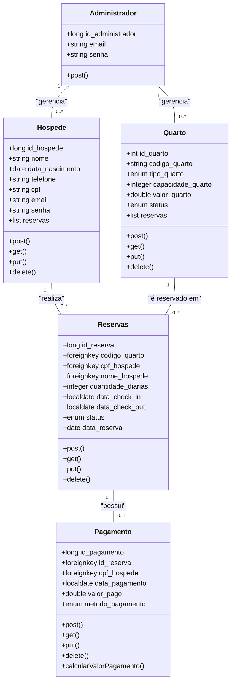
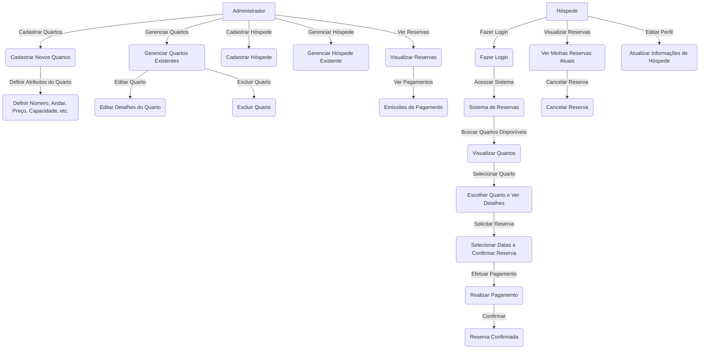
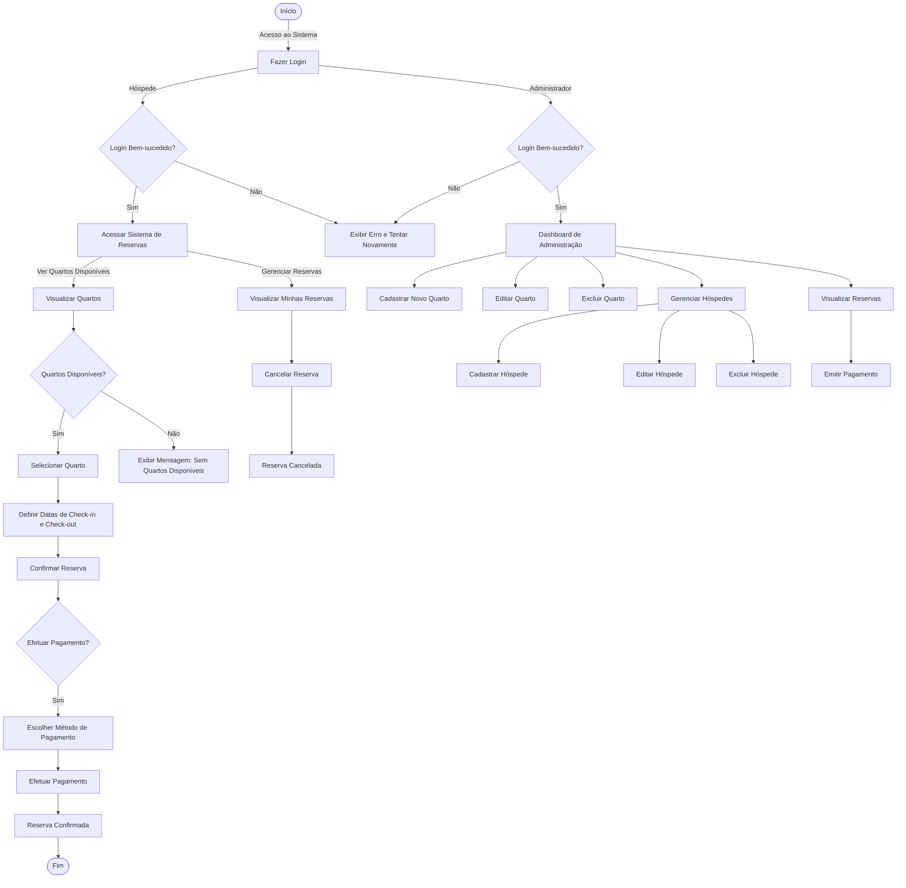

</a>
### Contexto Inicial
**Gerenciamento de Reservas de Hotel:**
O sistema será um gerenciamento de reservas de hotel, no qual o administrador poderá cadastrar hóspedes e funcionários, gerenciar reservas e acessar extratos de emissão fiscal, enquanto que o hóspede poderá solicitar a sua reserva em quartos disponíveis e efetuar o pagamento.

 
 
 

   

   
  
  
  

 
   

</a>

## Apresentação do Projeto: Desenvolvimento de Aplicação sobre Gerenciamento de Reservas

### Visão Geral do Projeto
**Objetivo:**
Desenvolver um sistema para gerenciamento de reservas de hotel, onde o administrador poderá cadastrar hóspedes e quartos, gerenciar reservas e acessar extratos de emissão fiscal. Hóspedes poderão solicitar reservas em quartos disponíveis e efetuar o pagamento. A aplicação utilizará tecnologias modernas e práticas de mercado, garantindo segurança, escalabilidade e uma experiência de usuário fluida por meio de Java Swing para a interface administrativa e Spring Boot para a API, com MongoDB como banco de dados.

**Por Que Este Projeto?**
A nossa empresa chamada Hostly, dedicada a inovar no campo da gestão de serviços, está em processo de criação de um sistema de gerenciamento de reservas de hotel. Este projeto visa proporcionar uma experiência eficiente tanto para os funcionários quanto para os hóspedes, facilitando o processo de reserva e gerenciamento dos quartos. Com o objetivo de transformar a forma como os hotéis gerenciam suas reservas e atendem aos hóspedes, estamos desenvolvendo uma solução tecnológica avançada que ofereça uma interface amigável e funcionalidades robustas.
     
</a>

O sistema de gerenciamento de reservas será desenvolvido utilizando Spring Boot para a API e Java Swing para a interface administrativa, com MongoDB como banco de dados. A solução visa proporcionar uma experiência de usuário intuitiva, com recursos para cadastro e gerenciamento de quartos, reservas, emissão de contratos e relatórios financeiros.
     

</a>

**Equipe:**
- 1 Gerente de Projetos
- 3 Desenvolvedores Full-Stack (Spring Boot e Java)
- 1 Administrador de Banco de Dados
- 1 Especialista em Segurança

**Tecnologias:**
- **Spring Boot** (API e Interface do Usuário)
- **Java Swing** (Interface Administrativa)
- **MongoDB** (Banco de Dados)
- **Git/GitHub** (Controle de Versão)

**Ferramentas de Gestão:**
- Trello para gerenciamento de tarefas
- Slack para comunicação interna
- Mermaid para montagem dos diagramas

     

</a>

     

</a>

     

</a>

     

### Acesso ao Sistema

1. **Realizar Cadastro (apenas hóspedes realizam cadastro):**
   - Na tela inicial, clique na opção **"Cadastrar"**.
   - Preencha todos os campos obrigatórios (nome, CPF, telefone, e-mail e senha) e clique em **"Salvar"**.
   - Após o cadastro, você receberá uma confirmação de que seu cadastro foi realizado com sucesso.

2. **Fazer Login:**
   - Após o cadastro, insira seu **e-mail** e **senha** nos campos apropriados.
   - Clique no botão **"Fazer Login"** para acessar o sistema.

### Para Hóspedes

3. **Visualizar Quartos Disponíveis:**
   - Após o login, você será direcionado para o sistema de reservas.
   - Clique na opção **"Ver Quartos Disponíveis"** para listar os quartos que podem ser reservados.

4. **Selecionar Quarto:**
   - Escolha um quarto da lista para visualizar os detalhes (número, capacidade, preço, etc.).
   - Clique em **"Solicitar Reserva"** para iniciar o processo de reserva.

5. **Definir Datas de Check-in e Check-out:**
   - Insira as datas desejadas para check-in e check-out.
   - Clique em **"Confirmar Reserva"**.

6. **Efetuar Pagamento:**
   - Escolha um método de pagamento (cartão de crédito, débito, etc.).
   - Clique em **"Efetuar Pagamento"** para finalizar a reserva.
   - Você verá uma mensagem de **"Reserva Confirmada"** após a conclusão do pagamento.

7. **Visualizar Reservas:**
   - Acesse a opção **"Minhas Reservas"** para ver todas as reservas feitas.
   - Você pode cancelar reservas existentes, se necessário.

8. **Editar Perfil:**
   - Acesse a opção **"Editar Perfil"** para atualizar suas informações pessoais, como telefone e endereço de e-mail.

### Para Administradores

9. **Acessar Dashboard:**
   - Após o login, você será direcionado ao **Dashboard de Administração**.
   - Aqui, você pode gerenciar quartos e hóspedes, além de visualizar reservas.

10. **Cadastrar Novo Quarto:**
    - Clique em **"Cadastrar Novo Quarto"** e preencha os campos necessários (número, andar, preço, capacidade, etc.).
    - Clique em **"Salvar"** para adicionar o quarto ao sistema.

11. **Gerenciar Quartos Existentes:**
    - Acesse a opção **"Gerenciar Quartos"** para visualizar todos os quartos cadastrados.
    - Você pode editar ou excluir quartos clicando nas opções correspondentes ao lado de cada quarto.

12. **Gerenciar Hóspedes:**
    - Clique em **"Gerenciar Hóspedes"** para visualizar e gerenciar os dados dos hóspedes.
    - Você pode cadastrar novos hóspedes, editar informações existentes ou excluir hóspedes.

13. **Visualizar Reservas:**
    - Acesse **"Visualizar Reservas"** para ver todas as reservas feitas por hóspedes.
    - Você pode emitir pagamentos e acessar extratos de emissão fiscal.
     

### - [Pasta de Testes Unitários](https://github.com/epicestudar/Hostly-spring-API/tree/main/hostly_api/src/main/java/com/example/hostly_api/Testes).
